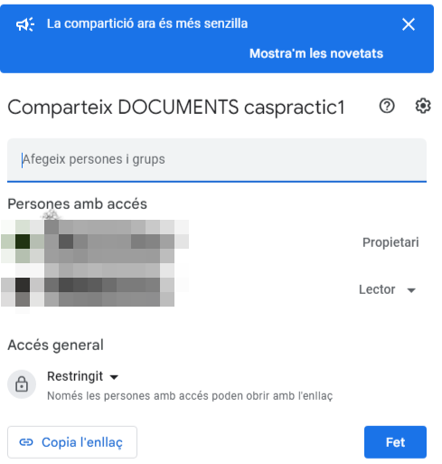

# CAS PRÀCTIC 1

## INDEX

- Primer Cas Pràctic	
- Guia de creació de les unitats compartides	
- Guia de creació de les unitats compartides BACKUP
- GUIA D'INSTAL·LACIÓ D'ADRECES DIRECTES ALS ESCRIPTORIS DE L’USUARI I ADMINISTRADOR
-------------------------------------------------------------------------------------

### 1- Primer Cas Pràctic

Per solucionar el problema de disc dur hem pensat de alquilar una subscripció a un cloud online, utilitza Google Drive podem fer les còpies de seguretat amb la tranquilitat de no perdre cap arxiu al hora de fer les còpies de seguretat diaries del que hem treballat durant el dia, i ens evitarem problemes físics com la que hem tingut al disc dur.
Investigant una miqueta m’hos hem donat compte que la millor opció el suscribirse a google drive amb l'extensió de 2TB de memoria que es la que tenia el disc dur físic.

#### Subscripció a Google drive

Tenim dues opcions, pagar mensualment o pagar anualment hem fet uns pressupostos del que sortiria anualment i mensualment i ens surt més a compte pagar l’anual.

Aquest és el pressupost que hem preparat per la subscripció anual i pel disc dur que ens ha trencat. Ens surt més rentable pagar anualment ja que ens aplica un descompte de un 17% que vindrien a ser 20,38€ menys.
Després he triat aquest disc dur de 2,5 TB de memoria que a calitat preu està molt bé.

Per determinar qui és l’administrador i l'usuari hem de crear la carpeta, document o unitat i compartir-ho, posarem els correus dels usuaris i determinarem els permisos.

